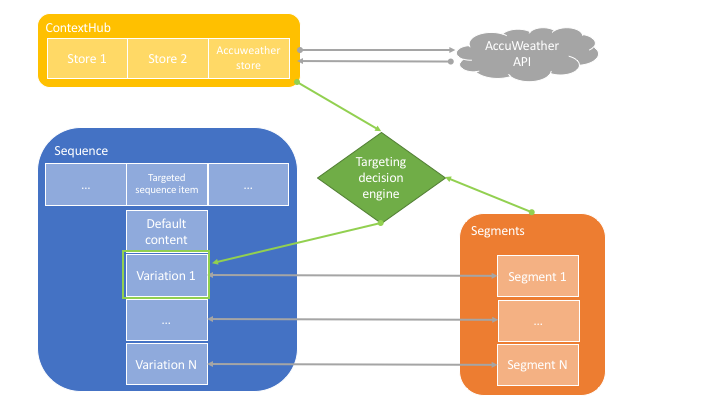

AccuWeather API integration
================================

Use Case
--------
Acme Corp is a multinational fast-food franchise. The company delivers content which is personalized based on the current weather in each location: if the weather is sunny, it might promote ice creams while when it is rainy or cold, it might promote hot coffee.

This how-to project walks you through how to achieve personalized content based on weather (provided by [www.accuweather.com](https://www.accuweather.com)).

The project leverages AEM [personalization](https://helpx.adobe.com/experience-manager/6-4/sites/administering/using/personalization.html) which includes the [ContextHub](https://helpx.adobe.com/experience-manager/6-4/sites/administering/using/contexthub-config.html), the [Segmentation engine](https://helpx.adobe.com/experience-manager/6-4/sites/administering/using/segmentation.html) and the [Content Targeting UI](https://helpx.adobe.com/experience-manager/6-4/sites/authoring/using/content-targeting-touch.html).

Warning: the project contains a demo apikey to connect to Accuweather APIs. It must be replaced by your own key for non-demo usage of the code. You can edit the apikey in the [AccuWeather store config](http://localhost:4502/etc/cloudsettings/screens-howto/contexthub/accuweather.edit.html).

### Architecture Diagram



How to Use the Sample Content
-----------------------------

- [Video recording](https://adobe.ly/2Jy9MZJ) showcasing the use case
- Open the [channel with content based on weather](http://localhost:4502/editor.html/content/screens/screens-howto/channels/data-trigger-accuweather/channel.edit.html)
- Switch to _Targeting_ mode
- Select _Screens HowTo_ brand and _Weather Based Campaign_ activity and hit the _Start Targeting_ button
- Explore the different content variations by switch the different _Audiences_
- Content can be edited per variation
- Switch then to _Preview_ mode
- Expand the _ContextHub_ which shows the current weather information: content displayed in the channel is the content defined for the current weather. For now, no simulation is possible and location is hardcoded to be Basel.

---

Technical Details
-----------------

### Compatibility

AEM version|Compatibility     |Comments
-----------|------------------|--------
6.3        |:white_check_mark:|
6.4        |:heavy_exclamation_mark:|While weather based content should be working, some bugs have been raised regarding segments authoring et ContextHub administration.

### Features built upon

The solution uses:
- the [ContextHub](https://helpx.adobe.com/experience-manager/6-4/sites/developing/using/contexthub.html)
- the [Segmentation engine](https://helpx.adobe.com/experience-manager/6-4/sites/administering/using/segmentation.html)
- the [Content Targeting UI](https://helpx.adobe.com/experience-manager/6-4/sites/authoring/using/ch-previewing.html#UIModuleFeatures)
- a standard Sequence Channel

### Manual installation

This module requires HowTo project and is part of the install process. Follow [instructions here](../../README.md).

If you still want to install the module individually, you can run:

```
mvn clean install content-package:install
```

### Manual content setup

Start by familiarizing yourself with the concept of [Personalization](https://helpx.adobe.com/experience-manager/6-4/sites/administering/user-guide.html?topic=/experience-manager/6-4/sites/administering/morehelp/personalization.ug.js) and [Authoring Targeted Content Using Targeting Mode
](https://helpx.adobe.com/experience-manager/6-4/sites/authoring/using/content-targeting-touch.html) for Sites.

Note that we won't be describing how to create the custom _ContextHub Store_ and its _Content Targeting UI_, nor the _Personalization Segments_ and _Personalization Audiences_ setup as the steps will vary in the various AEM versions and links to the documentation have been provided above in the [Features built upon](#features-built-upon) section.

1. [Create a screens project](https://helpx.adobe.com/experience-manager/6-4/sites/authoring/using/creating-a-screens-project.html)
0. [Create a new _sequence channel_](https://helpx.adobe.com/experience-manager/6-4/sites/authoring/using/managing-channels.html#CreatingaNewChannel) for the master sequence
0. [Edit the channel](https://helpx.adobe.com/experience-manager/6-4/sites/authoring/using/managing-channels.html#WorkingwithChannels) and add assets or components as needed.
0. Edit the channel properties and click the _Personalization_ tab
    - set _ContextHub Path_ to `/etc/cloudsettings/screens-howto/contexthub`
    - set _Segments Path_ to `/etc/segmentation/contexthub/screens-howto`
0. Click _Save & Close_ to save your changes
0. Edit the channel content and switch to _Targeting_ mode
0. Select _Screens HowTo_ brand and _Weather Based Campaign_ activity and hit the _Start Targeting_ button
0. Select the component for which you want to have targeted content
0. Click the _Target_ button to enable targeting for that component
0. Define the content for each variation (default, `Rainy or cloudy` weather and `Sunny` weather) by selecting the variation in the _Audiences_ in the side rail and adjusting the content as needed
0. Switch then to _Preview_ mode
0. Expand the _ContextHub_ which shows the current ASCII information (if not visible).
0. The content will adjust depending on the weather in Basel
    - For now, no simulation is possible

Sample Content Links
--------------------

+ Content
    + [Content based on weather channel in DCC](http://localhost:4502/screens.html/content/screens/screens-howto/channels/data-trigger-accuweather)
    + [Content based on weather - edition](http://localhost:4502/editor.html/content/screens/screens-howto/channels/data-trigger-accuweather/channel.edit.html)
+ Rules / Segments (access: Navigation > Personalization > Audiences)
    + [Rainy weather](http://localhost:4502/editor.html/etc/segmentation/contexthub/screens-howto/screens-howto-rainy.html)
    + [Sunny weather](http://localhost:4502/editor.html/etc/segmentation/contexthub/screens-howto/screens-howto-sunny.html)
+ ContextHub (access: Tools > Sites > ContextHub > screens-howto > ContextHub Configuration)
    + [AccuWeather store](http://localhost:4502/etc/cloudsettings/screens-howto/contexthub.html)
    + [AccuWeather store config](http://localhost:4502/etc/cloudsettings/screens-howto/contexthub/accuweather.edit.html) - the config contains the Accuweather id of the Basel location. this could be changed to another location (_path_ property of the config).
    + [AccuWeather module](http://localhost:4502/etc/cloudsettings/screens-howto/contexthub/ui.html)
    + [AccuWeather module config](http://localhost:4502/etc/cloudsettings/screens-howto/contexthub/ui/accuweather.edit.html)
