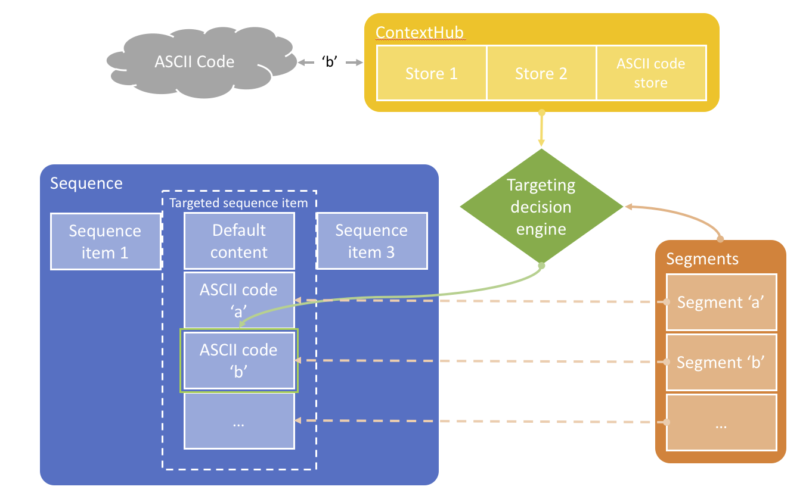

ASCII code data-triggers
========================

Use Case
--------

Acme Corp is a DIY retail store. In various areas of its stores, the company has shelves with electric tools (i.e. drills, screwdrivers, saws, etc.) and a bid screen showing product information when any of the tools is lifted up from the shelves. For instance, if the customer picks up the latest Bosch percussion drill, the screen will start playing an marketing video for it and also show some technical informations for the product. If the customer then picks up another drill, say the Makita one, the screen switches to the relevant product information.

This how-to project walks you through how to achieve this using a combination of ASCII code events and [AEM's Personalization and Content Targeting](https://helpx.adobe.com/experience-manager/6-4/sites/authoring/using/personalization.html) feature.

The project has a master sequence with a single targeted text component. Depending on keyboard events that are received, the content will switch to various content variations:
- `a`: switch to product `a` experience
- `b`: switch to product `b` experience
- anything else: switch to the default experience

The keyboard events mimic ASCII codes that would be sent by an activation switch in the store shelves and triggered when customers pick up the products.

### Architecture Diagram



How to Use the Sample Content
-----------------------------

1. Open the [sequence channel with content based on ascii codes](http://localhost:4502/editor.html/content/screens/screens-howto/channels/data-trigger-asciicodes/content.html)
0. Switch to _Targeting_ mode
0. Select _Screens HowTo_ brand and _ASCII Codes Based Campaign_ activity and hit the _Start Targeting_ button
0. Explore the different content variations by switching the different _Audiences_ and edit the content as needed
    - The default content
    - The content for the `a` ASCII code
    - The content for the `b` ASCII code
0. Switch then to _Preview_ mode
0. Expand the _ContextHub_ which shows the current ASCII information (if not visible).
0. Click inside the channel so it has focus
0. Hit various keys on your keyboard and see the content updating:
    - `a` and `b` have custom content
    - any other key shows the default content
    - ASCII code is cleared after 10 seconds
    - For now, no simulation is possible

---

Technical Details
-----------------

### Compatibility

AEM version|Compatibility           |Comments
-----------|------------------------|--------
6.3        |:white_check_mark:      |
6.4        |:heavy_exclamation_mark:|While ASCII-code based content should be working, some bugs have been raised regarding segments authoring and ContextHub administration.

### Features built upon

The solution uses:
- the [ContextHub](https://helpx.adobe.com/experience-manager/6-4/sites/developing/using/contexthub.html)
- the [Segmentation engine](https://helpx.adobe.com/experience-manager/6-4/sites/administering/using/segmentation.html)
- the [Content Targeting UI](https://helpx.adobe.com/experience-manager/6-4/sites/authoring/using/ch-previewing.html#UIModuleFeatures)
- a standard Sequence Channel

### Manual installation

This module requires HowTo project and is part of the install process. Follow [instructions here](../../README.md).

If you still want to install the module individually, you can run:

```
mvn clean install content-package:install
```

### Manual content setup

Start by familiarizing yourself with the concept of [Personalization](https://helpx.adobe.com/experience-manager/6-4/sites/administering/user-guide.html?topic=/experience-manager/6-4/sites/administering/morehelp/personalization.ug.js) and [Authoring Targeted Content Using Targeting Mode
](https://helpx.adobe.com/experience-manager/6-4/sites/authoring/using/content-targeting-touch.html) for Sites.

Note that we won't be describing how to create the custom _ContextHub Store_ and its _Content Targeting UI_, nor the _Personalization Segments_ and _Personalization Audiences_ setup as the steps will vary in the various AEM versions and links to the documentation have been provided above in the [Features built upon](#features-built-upon) section.

1. [Create a screens project](https://helpx.adobe.com/experience-manager/6-4/sites/authoring/using/creating-a-screens-project.html)
0. [Create a new _sequence channel_](https://helpx.adobe.com/experience-manager/6-4/sites/authoring/using/managing-channels.html#CreatingaNewChannel) for the master sequence
0. [Edit the channel](https://helpx.adobe.com/experience-manager/6-4/sites/authoring/using/managing-channels.html#WorkingwithChannels) and add assets or components as needed.
0. Edit the channel properties and click the _Personalization_ tab
    - set _ContextHub Path_ to `/etc/cloudsettings/screens-howto/contexthub`
    - set _Segments Path_ to `/etc/segmentation/contexthub/screens-howto`
0. Click _Save & Close_ to save your changes
0. Edit the channel content and switch to _Targeting_ mode
0. Select _Screens HowTo_ brand and _ASCII Codes Based Campaign_ activity and hit the _Start Targeting_ button
0. Select the component for which you want to have targeted content
0. Click the _Target_ button to enable targeting for that component
0. Define the content for each variation (default, `a` ASCII code and `b` ASCII code) by selecting the variation in the _Audiences_ in the side rail and adjusting the content as needed
0. Switch then to _Preview_ mode
0. Expand the _ContextHub_ which shows the current ASCII information (if not visible).
0. Click inside the channel so it has focus
0. Hit various keys on your keyboard and see the content updating:
    - `a` and `b` have custom content
    - any other key shows the default content
    - ASCII code is cleared after 10 seconds
    - For now, no simulation is possible


Sample Content Links
--------------------

+ Content
    + [Content based on ascii code channel in DCC](http://localhost:4502/screens.html/content/screens/screens-howto/channels/data-trigger-asciicodes)
    + [Content based on ascii code - edition](http://localhost:4502/editor.html/content/screens/screens-howto/channels/data-trigger-asciicodes/content.edit.html)
+ Rules / Segments (access: Navigation > Personalization > Audiences)
    + [ASCII code A](http://localhost:4502/editor.html/etc/segmentation/contexthub/screens-howto/screens-howto-ascii-a.html)
    + [ASCII code B](http://localhost:4502/editor.html/etc/segmentation/contexthub/screens-howto/screens-howto-ascii-b.html)
+ ContextHub (access: Tools > Sites > ContextHub > screens-howto > ContextHub Configuration)
    + [ASCII code store](http://localhost:4502/etc/cloudsettings/screens-howto/contexthub.html)
    + [ASCII code store config](http://localhost:4502/etc/cloudsettings/screens-howto/contexthub/asciicodes.edit.html)
    + [ASCII code module](http://localhost:4502/etc/cloudsettings/screens-howto/contexthub/ui.html)
    + [ASCII code module config](http://localhost:4502/etc/cloudsettings/screens-howto/contexthub/ui/asciicodes.edit.html)  
