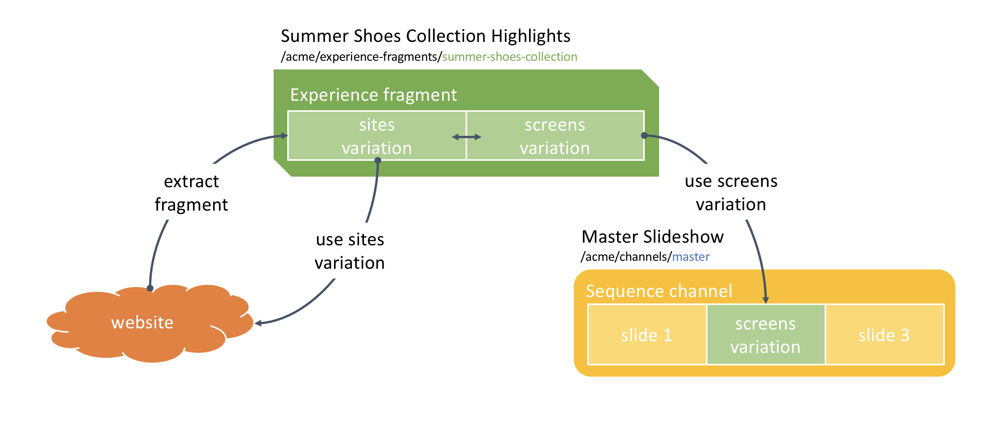

Content-Reuse with Experience Fragments
=======================================

Use Case
--------

Acme Corp is a shoe store franchise. It uses multiple channels to advertise its products to the customers. It has a website with the product catalog, a mobile app and in-store digital signage screens. There are obvious variations in the layout and content between these channels, but the company does want to re-use the product catalog pages across all the channels so they don't have to re-create the content each time. In essence, the marketing team designs the product pages for the website, and then re-uses the pages with slight modifications in the mobile app (different layout) and on the digital signage screens (no navigation menus and no customer interaction).

This how-to projects walks you through how to achieve these content variations using the concept of _experience fragments_ and 2 different approaches based on _live copies_ and _building blocks_.

The project presents 2 different approaches of using _experience fragments_ with various variations for the different communication channels. The 1st approach uses _live copies_ for the various variations, making it easy to replicate changes in the master fragment (i.e. the website) to the other variations such as the digital signage screens. The 2nd approach is based on _building blocks_ which define a static experience to which content is added specifically for each variation.

### Architecture Diagram



How to Use the Sample Content
-----------------------------

### Live Copies

- Navigate to the [Live Copy - Experience Fragment](http://localhost:4502/aem/experience-fragments.html/content/experience-fragments/howto-fragments/live-copy)
- Modify the [Content reuse — Web](http://localhost:4502/editor.html/content/experience-fragments/howto-fragments/live-copy/master.html)
- Select the _Content reuse — Screens_ variation
- Open the _References_ side rail, select the blueprint and click _Rollout_ to apply the changes to the Screens variation
- Modify the [Content reuse — Screens](http://localhost:4502/editor.html/content/experience-fragments/howto-fragments/live-copy/screens.html) variation

### Building Block (6.4 only)

- Navigate to the [Building Blocks - Experience Fragment](http://localhost:4502/aem/experience-fragments.html/content/experience-fragments/howto-fragments/building-blocks)
- Modify the [Content reuse — Web](http://localhost:4502/editor.html/content/screens/screens-howto/channels/experience-fragments/master.edit.html) building block variation
- Select the _Content reuse — Screens_ variation
- Modify the [Content reuse — Screens](http://localhost:4502/editor.html/content/experience-fragments/howto-fragments/building-blocks/screens.html) variation

---

Technical Details
-----------------

### Compatibility

AEM version|Compatibility           |Comments
-----------|------------------------|--------
6.3        |:heavy_exclamation_mark:| Building blocks do not exist is 6.4 and will fail to display in the experience fragment variations. Also, 6.3 does not let you convert existing content in Sites to new experience fragments, so you have to manually create the fragments and then assign each variation to the proper communication channel.
6.4        |:white_check_mark:      |

### Features built upon

The solution uses:
- [Experience Fragments](https://helpx.adobe.com/experience-manager/6-4/sites/authoring/using/experience-fragments.html)
- [Live Copies engine](https://helpx.adobe.com/experience-manager/6-4/sites/administering/using/msm.html#LiveCopies)
- [Building Blocks](https://helpx.adobe.com/experience-manager/kt/sites/using/experience-fragments-feature-video-use.html#building-blocks-experience-fragment)
- a standard Sequence Channel

### Manual installation

This module requires HowTo project and is part of the install process. Follow [instructions here](../../README.md).

If you still want to install the module individually, you can run:

```
mvn clean install content-package:install
```

### Manual content setup

Start by familiarizing yourself with [Experience Fragments](https://helpx.adobe.com/experience-manager/6-4/sites/authoring/using/experience-fragments.html) for Sites and make sure to create a fragment to be re-used.

1. [Create a screens project](https://helpx.adobe.com/experience-manager/6-4/sites/authoring/using/creating-a-screens-project.html)
0. [Create a new _sequence channel_](https://helpx.adobe.com/experience-manager/6-4/sites/authoring/using/managing-channels.html#CreatingaNewChannel) for the master sequence
0. [Edit the channel](https://helpx.adobe.com/experience-manager/6-4/sites/authoring/using/managing-channels.html#WorkingwithChannels) and add assets or components as needed.
0. Go to the [Experience Fragments Console](http://localhost:4502/aem/experience-fragments.html/content/experience-fragments)
0. Select the [Live Copy - Experience Fragment](http://localhost:4502/aem/experience-fragments.html/content/experience-fragments/howto-fragments/live-copy)
0. Open the _Create_ dropdown on the top right and click _Variation as live-copy_
0. Select the _Content reuse — Web_ variation as source, then give a name and title to the new Screens variation and validate
0. Edit the [Content reuse — Screens](http://localhost:4502/editor.html/content/experience-fragments/howto-fragments/live-copy/screens.html) variation and modify it as needed
0. Go back to your sequence channel and edit it
0. Add a new _Experience Fragment_ component and point it to the _Content reuse — Screens_ variation to use.
0. Modify the [Content reuse — Web](http://localhost:4502/editor.html/content/experience-fragments/howto-fragments/live-copy/master.html) variation to add new changes
0. Select the _Content reuse — Screens_ variation
0. Open the _References_ side rail, select the blueprint and click _Rollout_ to apply the changes to the Screens variation


Sample Content Links
--------------------

+ Content
    + [The Sites path](http://localhost:4502/editor.html/content/howto-experience-fragments/en.html)
    + [The Screens part](http://localhost:4502/editor.html/content/screens/screens-howto/channels/experience-fragments/master.html)
    + [The fragments](http://localhost:4502/aem/experience-fragments.html/content/experience-fragments/howto-fragments)
