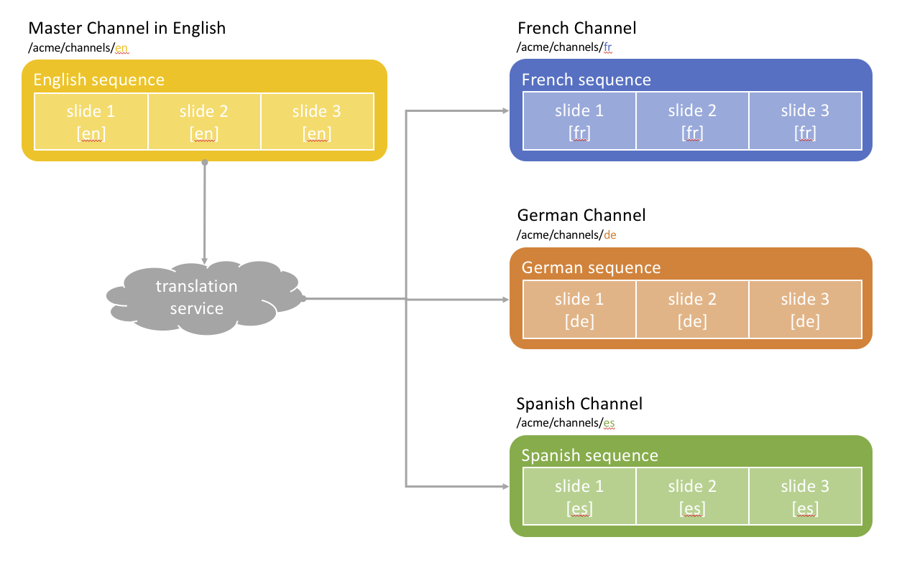

Live Copies Local Content
=========================

Use Case
--------
Acme Corp is a multinational fast-food franchise. The company has a global menu layout and uses it as a master slideshow on its menu boards. Since Acme Corp is established in several countries, it also has to provide localized menus in each country to better appeal to the customer base. Consider for example that you want to have an English menu in the United States, a French one in France, a German one in Germany and a Spanish one in Spain.

This how-to project walks you through how to achieve these localized versions using the concept of _language copies_ to automatically translate the content.

This module contains a sample on how to leverage _language copies_ to manage localized variations of the content in a Screens project.
It will use a master channel in English and automated translations for each country using _language copies_.

### Architecture Diagram

How to Use the Sample Content
-----------------------------



How to Use the Sample Content
-----------------------------

- Modify the master language channel by editing the [English Channel](http://localhost:4502/screens.html/content/screens/screens-howto/channels/localised-content-language-copy/en)
- Open the _References_ side rail for the channel and select one of the  _Language Copies_
- Open the _Update language copies_ menu
- Select to _Create a new translation project_, specify a name and click _Update_
    - The language copy is annotated with an exclamation mark
- Select the language copy again
- Open the _Launch_ menu, and click _Promote_
- Click _Next_ and then _Promote_
    - Translation is automatically done behind the scene
- Preview the language copy and you'll see the channel has automatically updated to the latest changes from the master language and translated accordingly

---

Technical Details
-----------------

### Features built upon

The solution uses:
- a main _sequence channel_ for the master language `en`
- individual _language copies_ for each localized version of the master
- translation service

### Manual installation

This module requires HowTo project and is part of the install process. Follow [instructions here](../../README.md).

If you still want to install the module individually, you can run:

```
mvn clean install content-package:install
```

### Manual content setup

Start by familiarizing yourself with [Managing Translation Projects](https://helpx.adobe.com/experience-manager/6-4/sites/administering/using/tc-manage.html#CreatingTranslationProjectsUsingtheReferencesPanel) for Sites.

1. [Create a screens project](https://helpx.adobe.com/experience-manager/6-4/sites/authoring/using/creating-a-screens-project.html)
0. Edit the project properties and use the _Microsoft Translator_ (or your own custom translation service) in the _Cloud Services_ tab. Then _Save_ and close the properties
0. [Create a new _sequence channel_](https://helpx.adobe.com/experience-manager/6-4/sites/authoring/using/managing-channels.html#CreatingaNewChannel) for the master language and make sure to use a valid language code for the name (i.e. `en`, `en_US`, etc.)
    -  You can verify the setup is correctly done by opening the _References_ side rail and checking that the channel shows up in the _Language Copies_ section
0. [Edit the channel](https://helpx.adobe.com/experience-manager/6-4/sites/authoring/using/managing-channels.html#WorkingwithChannels) and add assets or components as needed.
0. Click the _Language Copy_ button in the Create menu on the top right in the Screens admin console
0. Click _Add Pages_ and select the master language channel you created above, and clic _Next_
0. Select _French_, _German_ and _Spanish_ from the _Languages_ dropdown, and click _Next_
0. Choose _Create a new translation project_ in the _Project_ dropdown list, specify a title and click _Create_
0. Go to the _Projects_ console and select your translation project, and the desired target language (i.e. French)
0. Select _Complete_ from the _Translation Job_ tile
0. Go back to your target language channel in Screens (i.e. French), you'll see it has been translated automatically for you
    - Feel free to edit the channel and adjust the translation as needed
0. Repeat steps 9. to 11. for each language


Sample Content Links
--------------------

+ Content
    + [English Channel](http://localhost:4502/screens.html/content/screens/screens-howto/channels/localised-content-language-copy/en)
    + [English Channel - edition](http://localhost:4502/editor.html/content/screens/screens-howto/channels/localised-content-language-copy/en.html)
    + [French Channel](http://localhost:4502/screens.html/content/screens/screens-howto/channels/localised-content-language-copy/fr)
    + [French Channel - edition](http://localhost:4502/editor.html/content/screens/screens-howto/channels/localised-content-language-copy/fr.html)
    + [German Channel](http://localhost:4502/screens.html/content/screens/screens-howto/channels/localised-content-language-copy/de)
    + [German Channel - edition](http://localhost:4502/editor.html/content/screens/screens-howto/channels/localised-content-language-copy/de.html)
    + [Spanish Channel](http://localhost:4502/screens.html/content/screens/screens-howto/channels/localised-content-language-copy/es)
    + [Spanish Channel - edition](http://localhost:4502/editor.html/content/screens/screens-howto/channels/localised-content-language-copy/es.html)
