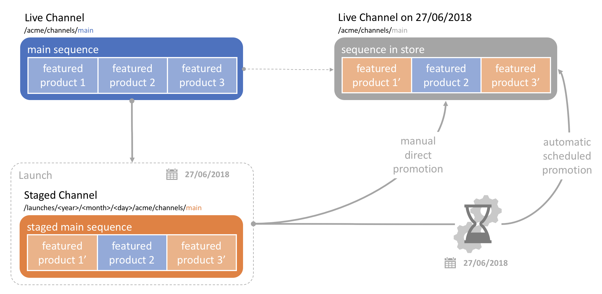

Scheduled content updates using Launches
========================================

Use Case
--------
Acme Corp is a gas station franchise that uses Screens for its gas prices billboards. Gas prices are updated once a week, on Monday mornings right after midnight, but the content is prepared the week before and validated before it gets pushed to the various locations. Moreover, the company does not want its authors to have to manually push the content over night to the Screens, so it uses a scheduled content update mechanism to roll out the changes.

This how-to project walks you through how to use the concept of _Launches_ to achieve this.

The project has a simple _sequence channel_. A _Launch_ has been prepared with some content modifications, but hasn't been rolled out yet (i.e. it is _unpromoted_. Authors can manually promote the _Launch_ or schedule an automatic _Launch Date_ if needed.

### Architecture Diagram



How to Use the Sample Content
-----------------------------

- Modify the prepared launch for the sequence channel by editing the [Sequence Channel Launch](http://localhost:4502/editor.html/content/launches/2018/03/07/content_update/content/screens/screens-howto/channels/content-update-launches/master.html)
- Go to the [main sequence channel](http://localhost:4502/screens.html/content/screens/screens-howto/channels/content-update-launches)
- Open the _References_ side rail by clicking the top left button
- Select the prepared launch from the _Launches_ category
- _Promote_ the launch to make your changes public, or
- _Edit Properties_ to set a automatic launch date

---

Technical Details
-----------------

### Compatibility

AEM version|Compatibility     |Comments
-----------|------------------|--------
6.3        |:white_check_mark:|
6.4        |:white_check_mark:|

### Features built upon

The solution uses:
- a main _sequence channel_
- an _unpromoted Launch_ that contains a copy of the channel with some modifications

### Manual installation

This module requires HowTo project and is part of the install process. Follow [instructions here](../../README.md).

If you still want to install the module individually, you can run:

```
mvn clean install content-package:install
```

### Manual content setup

Start by familiarizing yourself with the concept of [Launch](https://helpx.adobe.com/experience-manager/6-4/sites/authoring/using/launches.html) for Sites.

1. [Create a screens project](https://helpx.adobe.com/experience-manager/6-4/sites/authoring/using/creating-a-screens-project.html)
0. [Create a new _sequence channel_](https://helpx.adobe.com/experience-manager/6-4/sites/authoring/using/managing-channels.html#CreatingaNewChannel) for the main sequence
0. Click _Launch_ in the blue _Create_ dropdown menu in the Screens admin console
0. Click _Add Pages_ and select the main sequence, then click _Next_
0. Specify a title for the _Launch_, then click _Create_
    - You can specify a _Launch Date_ for an automatic rollout if needed
0. Select the main sequence and open the _References_ side rail from the icon on the top left in the Screens console
0. Select the launch you just created from the _Launches_ category
    - You can edit the main sequence copy
    - _Promote_ the launch to make the content public
    - Edit the launch to add/remove pages to/from edit
    - Edit the launch properties to adjust the launch date

Sample Content Links
--------------------

+ Content
    + [Sequence Channel](http://localhost:4502/screens.html/content/screens/screens-howto/channels/content-update-launches)
    + [Prepared Unpromoted Launch](http://localhost:4502/libs/launches/content/launches/edit.html?item=/content/launches/2018/03/07/content_update)
    + [Prepared Copy of the Sequence Channel](http://localhost:4502/editor.html/content/launches/2018/03/07/content_update/content/screens/screens-howto/channels/content-update-launches/master.html)
