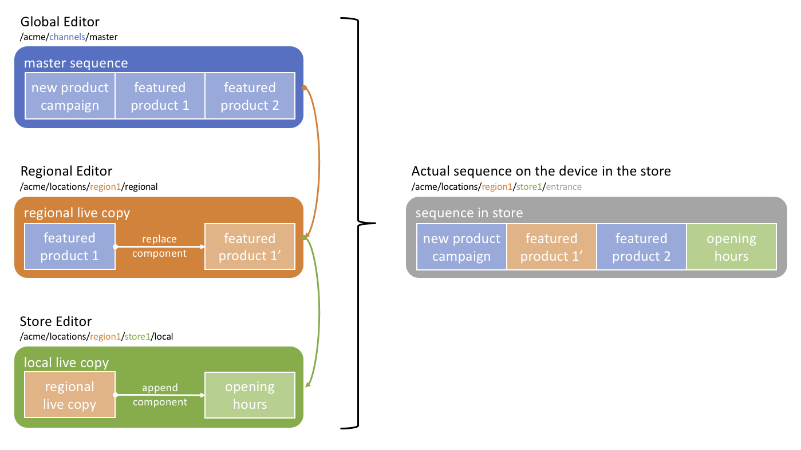

Live Copies Local Content
=========================

Use Case
--------
Acme Corp is a multinational fast-food franchise. The company has a global menu layout and uses it as a master slideshow on its menu boards. Local franchises, however, may wish to add to the content to allow for store specials. Certain menu items may also differ due to cultural or regional reasons. Consider for example that you wish to create a Kosher offering for Israel, a vegetarian offering for India and a Halal offering for all middle-eastern countries. Moreover, when rolling out new global content, we may not want to deploy immediately to all stores and may want to have several waves of rollouts.

This how-to project walks you through how to achieve these local overrides using the concept of _live copies_.

The project has a master sequence managed acting as a _blueprint_ at the global level for the brand.
Individual regions/branches/offices/stores can customize parts of the _blueprint_ and inject location-specific content (i.e. opening hours, special deals, team information, etc.) by using a _live copy_ of the master sequence. Moreover, the authors may want to synchronize the content changes to individual branches first and not all at once.

### Architecture Diagram



How to Use the Sample Content
-----------------------------

- Modify the global content in the master sequence (_blueprint_) by editing the [Master Channel](http://localhost:4502/content/screens/screens-howto/channels/local-content-live-copy)
- Rollout the changes to the local channels…
- Modify the location specific content by editing [Local Channel 1](http://localhost:4502/screens.html/content/screens/screens-howto/locations/local-content-live-copy/branch-office-1/local) or [Local Channel 2](http://localhost:4502/screens.html/content/screens/screens-howto/locations/local-content-live-copy/branch-office-2/local)

---

Technical Details
-----------------

### Compatibility

AEM version|Compatibility     |Comments
-----------|------------------|--------
6.3        |:warning:         |Rollout only works from the _References_ side rail
6.4        |:white_check_mark:|

### Features built upon

The solution uses:
- a main _sequence channel_ for the master sequence set as a _blueprint_
- individual _live copies_ from this _blueprint_ in the respective locations

### Manual installation

This module requires HowTo project and is part of the install process. Follow [instructions here](../../README.md).

If you still want to install the module individually, you can run:

```
mvn clean install content-package:install
```

### Manual content setup

1. [Create a screens project](https://helpx.adobe.com/experience-manager/6-4/sites/authoring/using/creating-a-screens-project.html)
0. [Create a new _sequence channel_](https://helpx.adobe.com/experience-manager/6-4/sites/authoring/using/managing-channels.html#CreatingaNewChannel) for the master sequence
0. [Edit the channel](https://helpx.adobe.com/experience-manager/6-4/sites/authoring/using/managing-channels.html#WorkingwithChannels) and add assets or components as needed.
0. [Add locations](https://helpx.adobe.com/experience-manager/6-4/sites/authoring/using/managing-locations.html#CreatingaNewLocation) as needed, along with [their respective display](https://helpx.adobe.com/experience-manager/6-4/sites/authoring/using/managing-displays.html#CreatingaNewDisplay)
0. Create a _live copy_ from the _create_ dropdown on the top right. Select the master sequence as source and set the destination to one of the locations
0. [Assign the _live copy_ to the local displays](https://helpx.adobe.com/experience-manager/6-4/sites/authoring/using/channel-assignment.html)
0. Repeat 5. and 6. for each location


Sample Content Links
--------------------

+ Content
    + [Master Channel](http://localhost:4502/screens.html/content/screens/screens-howto/channels/local-content-live-copy/master)
    + [Master Channel - edition](http://localhost:4502/editor.html/content/screens/screens-howto/channels/local-content-live-copy/master.html)
    + [Branch locations](http://localhost:4502/screens.html/content/screens/screens-howto/locations/local-content-live-copy)
        + [Local Channel 1](http://localhost:4502/screens.html/content/screens/screens-howto/locations/local-content-live-copy/branch-office-1/local)
        + [Local Channel 1 - edition](http://localhost:4502/editor.html/content/screens/screens-howto/locations/local-content-live-copy/branch-office-1/local.html)
        + [Local Channel 2](http://localhost:4502/screens.html/content/screens/screens-howto/locations/local-content-live-copy/branch-office-2/local)
        + [Local Channel 2 - edition](http://localhost:4502/editor.html/content/screens/screens-howto/locations/local-content-live-copy/branch-office-2/local.html)
