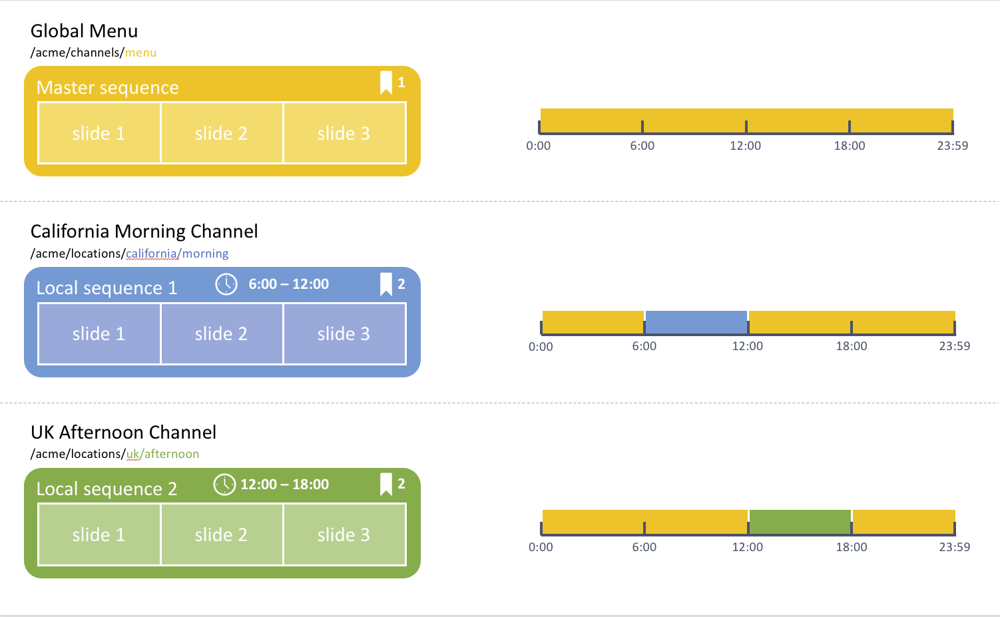

Special Events Content
======================

Use Case
--------
Acme Corp is a restaurant franchise that focuses on local produces. The company has a global menu for all its stores, but each local franchise has the option to offer additional options for breakfast or in the afternoon. Consider for example that you wish to create a local Californian offering that includes a coffee shop option in the morning with breakfast offerings, while the Londonian franchises will have tea time offerings in the afternoon.

This how-to project walks you through how to achieve these local overrides using the concept of _channel assignment priorities_.

The project has a master sequence managed at the global level by the franchise.
Individual regions/branches/stores can create local channels and have them overwrite the

This module contains a sample on how to leverage channel priorities to manage local content overrides in a Screens project.
It will use a master channel for the whole project with local channels having higher priorities at specific times of the day and overwriting the master sequence by using a higher _priority_ in the _channel assignment_.

### Architecture Diagram



How to Use the Sample Content
-----------------------------

- Modify the global content in the master sequence by editing the [Master Channel](http://localhost:4502/screens.html/content/screens/screens-howto/channels/special-event-channel-priority/master-channel)
- Modify the location specific content by editing [Local Channel 1](http://localhost:4502/screens.html/content/screens/screens-howto/locations/special-event-channel-priority/branch-office-1/local) or [Local Channel 2](http://localhost:4502/screens.html/content/screens/screens-howto/locations/special-event-channel-priority/branch-office-2/local)
- Modify the day parting and priorities for the assignments by respectively editing the [Branch Office 1 Display](http://localhost:4502/screens/dashboard/display.html/content/screens/screens-howto/locations/special-event-channel-priority/branch-office-1/main-display) and [Branch Office 2 Display](http://localhost:4502/screens/dashboard/display.html/content/screens/screens-howto/locations/special-event-channel-priority/branch-office-2/main-display)
    - Changing the _Schedule_ expression and the _active from_ and _active until_ dates lets you adjust the day parting
    - Changing the priority lets you decide which channel takes over in case of scheduling overlaps (higher priority takes over)

---

Technical Details
-----------------

### Compatibility

AEM version|Compatibility     |Comments
-----------|------------------|--------
6.3        |:white_check_mark:|
6.4        |:white_check_mark:|

### Features built upon

The solution uses:
- a main _sequence channel_ for the default franchise content assigned with _priority_ `1` to all _displays_
- individual _sequence channels_ for the local store overrides assigned to the local _display_ with a higher _priority_ `2`
- some _schedule_ expression to let the local store overrides run in the morning, respectively in the afternoon

### Manual installation

This module requires HowTo project and is part of the install process. Follow [instructions here](../../README.md).

If you still want to install the module individually, you can run:

```
mvn clean install content-package:install
```

### Manual content setup

1. [Create a screens project](https://helpx.adobe.com/experience-manager/6-4/sites/authoring/using/creating-a-screens-project.html)
0. [Create a new _sequence channel_](https://helpx.adobe.com/experience-manager/6-4/sites/authoring/using/managing-channels.html#CreatingaNewChannel) for the master sequence
0. [Edit the channel](https://helpx.adobe.com/experience-manager/6-4/sites/authoring/using/managing-channels.html#WorkingwithChannels) and add assets or components as needed.
0. [Add locations](https://helpx.adobe.com/experience-manager/6-4/sites/authoring/using/managing-locations.html#CreatingaNewLocation) as needed, along with [their respective display](https://helpx.adobe.com/experience-manager/6-4/sites/authoring/using/managing-displays.html#CreatingaNewDisplay)
0. Create local channels in each location
0. [Assign the local channels to the local displays](https://helpx.adobe.com/experience-manager/6-4/sites/authoring/using/channel-assignment.html) and make sure to set the _priority_ to `2` so it takes over the master sequence
0. Enable day parting by adding a _schedule_ expression to the assignment, for instance:
    - `before 9:00 am` for 12am to 9am
    - `after 9:00 pm` for 9pm to 12am
    - `after 11:00 am and before 1:00 pm` for 11am to 1pm
    - `after 9:00 and before 14:00 on Wed, Thu and Fri` for 9:00 am to 2:00 pm on every Wednesday, Thursday and Friday

Sample Content Links
--------------------

+ Content
    + [Master Channel](http://localhost:4502/screens.html/content/screens/screens-howto/channels/special-event-channel-priority/master-channel)
    + [Master Channel - edition](http://localhost:4502/editor.html/content/screens/screens-howto/channels/special-event-channel-priority/master-channel.html)
    + [Branch locations](http://localhost:4502/screens.html/content/screens/screens-howto/locations/special-event-channel-priority)
        + [Local Channel 1](http://localhost:4502/screens.html/content/screens/screens-howto/locations/special-event-channel-priority/branch-office-1/local)
        + [Local Channel 1 - edition](http://localhost:4502/editor.html/content/screens/screens-howto/locations/special-event-channel-priority/branch-office-1/local.html)
        + [Local Channel 2](http://localhost:4502/screens.html/content/screens/screens-howto/locations/special-event-channel-priority/branch-office-2/local)
        + [Local Channel 2 - edition](http://localhost:4502/editor.html/content/screens/screens-howto/locations/special-event-channel-priority/branch-office-2/local.html)
