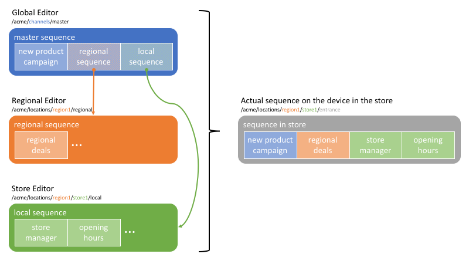

Embedded Sequences Local Content
================================

Use Case
--------
Acme Corp is a multinational fast-food franchise. The company has a global menu layout and uses it as a master slideshow on its menu boards. Local franchises, however, may wish to add to the content to allow for store specials. Certain menu items may also differ due to cultural or regional reasons. Consider for example that you wish to create a Kosher offering for Israel, a vegetarian offering for India and a Halal offering for all middle-eastern countries. Moreover, local franchises should not be able to modify the complete master slideshow, but only some parts of it.

This how-to project walks you through how to achieve these local overrides using the concept of _dynamic embedded sequences_.

The project has a master sequence managed at the global level for the brand.
Individual regions/branches/offices/stores can customize parts of the master sequence and inject location-specific content (i.e. opening hours, special deals, team information, etc.) by using an _dynamic embedded sequence_. Moreover, the separation of content between master and local sequences lets the brand set different permissions on each so only the right person responsible for the content may edit it.

### Architecture Diagram



How to Use the Sample Content
-----------------------------

- Modify the global content in the master sequence by editing the [Master Channel](http://localhost:4502/screens.html/content/screens/screens-howto/channels/local-content-subsequence/master)
- Modify the location specific content by editing [Local Channel 1](http://localhost:4502/screens.html/content/screens/screens-howto/locations/local-content-subsequence/branch-office-1/local) or [Local Channel 2](http://localhost:4502/screens.html/content/screens/screens-howto/locations/local-content-subsequence/branch-office-2/local)
- Modify the assignments by editing the [Default Schedule](http://localhost:4502/screens/dashboard/schedule.html/content/screens/screens-howto/schedules/local-content--default-schedule)

---

Technical Details
-----------------

### Compatibility

AEM version|Compatibility     |Comments
-----------|------------------|--------
6.3        |:white_check_mark:|
6.4        |:white_check_mark:|

### Features built upon

The solution uses:
- a main _sequence channel_ for the master sequence
- _dynamic embedded sequence_ components for each locally customizable part of the sequence
- individual _sequence channels_ in the respective locations with a _role_ in the display that matches the _dynamic embedded sequence component_'s _role_

### Manual installation

This module requires HowTo project and is part of the install process. Follow [instructions here](../../README.md).

If you still want to install the module individually, you can run:

```
mvn clean install content-package:install
```

### Manual content setup

1. [Create a screens project](https://helpx.adobe.com/experience-manager/6-4/sites/authoring/using/creating-a-screens-project.html)
0. [Create a new _sequence channel_](https://helpx.adobe.com/experience-manager/6-4/sites/authoring/using/managing-channels.html#CreatingaNewChannel) for the master sequence
0. [Edit the channel](https://helpx.adobe.com/experience-manager/6-4/sites/authoring/using/managing-channels.html#WorkingwithChannels) and add assets or components as needed.
0. Also add some _dynamic embedded sequence_ components for each placeholder item that can be customized at the desired locations
0. [Create a global schedule](https://helpx.adobe.com/experience-manager/6-4/sites/authoring/using/managing-schedules.html#CreatingaSchedule) valid for all locations, and use [channel assignments _by name_](https://helpx.adobe.com/experience-manager/6-4/sites/authoring/using/channel-assignment.html) to link the location specific channels. Make sure the _role_ matches the role used in the _dynamic embedded sequence_ in step 4.
0. [Add locations](https://helpx.adobe.com/experience-manager/6-4/sites/authoring/using/managing-locations.html#CreatingaNewLocation) as needed, along with [their respective display](https://helpx.adobe.com/experience-manager/6-4/sites/authoring/using/managing-displays.html#CreatingaNewDisplay)
0. Create channels for each placeholder in each location, and make sure the channel _name_ (not title) matches the _channel name_ in the assignments defined in step 5.


Sample Content Links
--------------------

+ [Master Channel](http://localhost:4502/screens.html/content/screens/screens-howto/channels/local-content-subsequence/master) and [Master Channel - edition](http://localhost:4502/editor.html/content/screens/screens-howto/channels/local-content-subsequence/master.html)
+ [Default Schedule](http://localhost:4502/screens/dashboard/schedule.html/content/screens/screens-howto/schedules/local-content--default-schedule)
+ [Branch locations](http://localhost:4502/screens.html/content/screens/screens-howto/locations/local-content-subsequence)
    + [Local Channel 1](http://localhost:4502/screens.html/content/screens/screens-howto/locations/local-content-subsequence/branch-office-1/local)
    and [Local Channel 1 - edition](http://localhost:4502/editor.html/content/screens/screens-howto/locations/local-content-subsequence/branch-office-1/local.html)
    + [Local Channel 2](http://localhost:4502/screens.html/content/screens/screens-howto/locations/local-content-subsequence/branch-office-2/local) and [Local Channel 2 - edition](http://localhost:4502/editor.html/content/screens/screens-howto/locations/local-content-subsequence/branch-office-2/local.html)
